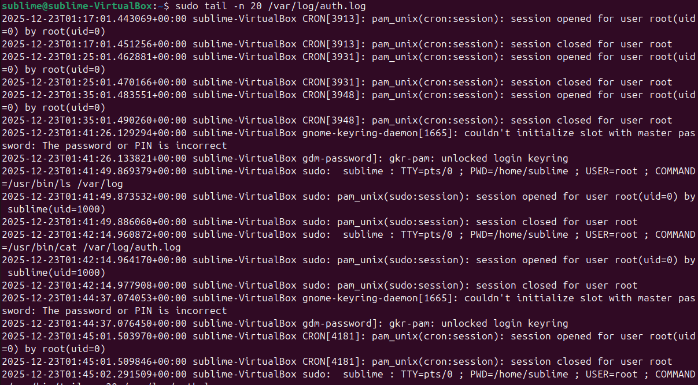

# 🔵 Blue Team Lab

---

## 📝 Objective
Build an isolated home lab to practice Blue Team cybersecurity skills: monitoring, analyzing, and detecting network activity.

---

## 💻 Lab Setup
- **Attacker VM:** Kali Linux  
- **Defender VM:** Ubuntu  
- **Network:** Host-only / internal network (traffic flows only between VMs)  

---

## 🔹 Experiments Completed
- Captured ICMP (ping) traffic using Wireshark  
- Simulated reconnaissance scans with Nmap  
- Configured firewall logging on Ubuntu to detect network scans  
- Practiced analyzing traffic and identifying suspicious activity
- Practised 

---

## 🛠️ Skills Practiced
- Network configuration and segmentation  
- Traffic monitoring and packet analysis  
- Logging and detection of suspicious activity  
- Linux command line & networking tools  
- Basic Blue Team operations  

---

## 📂 Screenshots & Logs

### ICMP Traffic Capture

---

## 🚀 Future Work
- Capture and analyze more advanced attack types  
- Automate log analysis with Python scripts  
- Explore alerting and dashboarding tools (ELK Stack, Grafana)  
- Document lab experiments in more detail  

---

## 📈 GitHub Profile Integration
This project contributes to my [GitHub profile](https://github.com/oliver-burns) showcasing active Blue Team learning.

